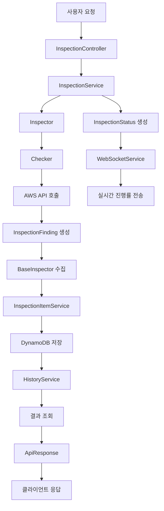

# 📊 데이터 모델 구조 가이드

## 📋 목차
1. [모델 개요](#모델-개요)
2. [InspectionFinding 모델](#inspectionfinding-모델)
3. [InspectionItemResult 모델](#inspectionitemresult-모델)
4. [InspectionStatus 모델](#inspectionstatus-모델)
5. [ApiResponse 모델](#apiresponse-모델)
6. [데이터 흐름도](#데이터-흐름도)

---

## 🎯 모델 개요

AWS 보안 검사 시스템은 **4개의 핵심 모델**로 구성되어 있습니다.

| 모델 | 역할 | 사용 시점 |
|------|------|-----------|
| **InspectionFinding** | 🔍 문제 발견 기록 | Inspector가 AWS 리소스에서 문제 발견 시 |
| **InspectionItemResult** | 💾 데이터 저장/조회 | 검사 완료 후 결과 저장 및 히스토리 조회 시 |
| **InspectionStatus** | ⏱️ 진행률 추적 | 검사 진행 중 실시간 상태 업데이트 시 |
| **ApiResponse** | 📡 응답 표준화 | 모든 API 응답 시 |

---

## 🔍 InspectionFinding 모델

### 📝 **역할**
개별 AWS 리소스에서 발견된 보안 문제를 표현하는 모델

### 🏗️ **구조**
```javascript
class InspectionFinding {
  constructor({
    resourceId,      // 문제가 있는 리소스 ID
    resourceType,    // 리소스 타입 (SecurityGroup, Instance 등)
    issue,          // 발견된 문제 설명
    recommendation  // 해결 방법 권장사항
  })
}
```

### 📋 **예시 데이터**
```json
{
  "resourceId": "sg-12345678",
  "resourceType": "SecurityGroup",
  "issue": "SSH 포트(22)가 인터넷(0.0.0.0/0)에 개방되어 있습니다",
  "recommendation": "SSH 접근을 특정 IP 범위로 제한하세요. 예: 회사 IP 대역만 허용"
}
```

### 🔧 **주요 메서드**
```javascript
// API 응답용 변환
finding.toApiResponse()

// 유효성 검증
finding.validate()

// 요약 통계 생성 (정적 메서드)
InspectionFinding.generateSummary(findings)
```

### 📍 **사용 위치**
- `backend/services/inspectors/*/checks/*.js` - Checker에서 생성
- `backend/services/inspectors/baseInspector.js` - 수집 및 관리

---

## 💾 InspectionItemResult 모델

### 📝 **역할**
검사 항목별 결과를 DynamoDB에 효율적으로 저장하고 조회하기 위한 스키마

### 🏗️ **DynamoDB 테이블 구조**
```javascript
{
  TableName: 'InspectionItemResults',
  KeySchema: [
    { AttributeName: 'customerId', KeyType: 'HASH' },    // 파티션 키
    { AttributeName: 'itemKey', KeyType: 'RANGE' }       // 정렬 키
  ]
}
```

### 🔑 **itemKey 구조**
```javascript
// 최신 결과 (빠른 조회용)
"LATEST#{serviceType}#{itemId}"
// 예: "LATEST#EC2#dangerous-ports"

// 히스토리 (시간순 정렬)
"HISTORY#{serviceType}#{itemId}#{reversedTimestamp}#{inspectionId}"
// 예: "HISTORY#EC2#dangerous-ports#9999998359004800#insp-456"
```

### 📊 **저장 데이터 구조**
```json
{
  "customerId": "user-123",
  "itemKey": "LATEST#EC2#dangerous-ports",
  "serviceType": "EC2",
  "itemId": "dangerous-ports",
  "category": "security",
  "inspectionTime": 1640995200000,
  "status": "FAIL",
  "totalResources": 5,
  "issuesFound": 2,
  "findings": [
    {
      "resourceId": "sg-12345678",
      "resourceType": "SecurityGroup",
      "issue": "SSH 포트가 인터넷에 개방됨",
      "recommendation": "포트 접근 제한 필요"
    }
  ]
}
```

### 🔧 **Helper 함수들**
```javascript
const { helpers } = require('../models/InspectionItemResult');

// LATEST 키 생성
helpers.createLatestKey('EC2', 'dangerous-ports')
// → "LATEST#EC2#dangerous-ports"

// HISTORY 키 생성 (시간 역순 정렬)
helpers.createHistoryKey('EC2', 'dangerous-ports', timestamp, inspectionId)
// → "HISTORY#EC2#dangerous-ports#9999998359004800#insp-456"

// 키 파싱
helpers.parseItemKey(itemKey)
// → { recordType: 'LATEST', serviceType: 'EC2', itemId: 'dangerous-ports' }
```

### 📍 **사용 위치**
- `backend/services/inspectionItemService.js` - 저장/조회 로직
- `backend/services/historyService.js` - 히스토리 관리

---

## ⏱️ InspectionStatus 모델

### 📝 **역할**
검사 진행 상태와 실시간 진행률을 추적하는 모델

### 🏗️ **구조**
```javascript
class InspectionStatus {
  constructor({
    inspectionId,           // 검사 ID
    status,                // PENDING, IN_PROGRESS, COMPLETED, FAILED
    progress,              // 진행률 정보
    estimatedTimeRemaining, // 예상 남은 시간
    currentStep,           // 현재 진행 단계
    error,                 // 에러 정보 (실패 시)
    batchId,              // 배치 검사 ID
    itemId,               // 검사 항목 ID
    itemName              // 검사 항목명
  })
}
```

### 📊 **진행률 데이터 구조**
```json
{
  "inspectionId": "insp-123",
  "status": "IN_PROGRESS",
  "progress": {
    "currentStep": "EC2 보안 그룹 검사 중",
    "completedSteps": 3,
    "totalSteps": 10,
    "percentage": 30,
    "resourcesProcessed": 15
  },
  "estimatedTimeRemaining": 45000,
  "startTime": 1640995200000,
  "lastUpdated": 1640995230000
}
```

### 🔧 **주요 메서드**
```javascript
// 검사 시작
status.start('검사 초기화 중')

// 진행률 업데이트
status.updateProgress({
  currentStep: 'EC2 인스턴스 검사 중',
  completedSteps: 5,
  totalSteps: 10,
  percentage: 50
})

// 검사 완료
status.complete()

// 검사 실패
status.fail('AWS 권한 부족')

// API 응답용 변환
status.toApiResponse()
```

### 📍 **사용 위치**
- `backend/services/inspectionService.js` - 검사 진행률 관리
- `backend/services/websocketService.js` - 실시간 전송

---

## 📡 ApiResponse 모델

### 📝 **역할**
모든 API 응답의 표준 형식을 제공하고 일관된 에러 처리를 담당

### 🏗️ **구조**
```javascript
class ApiResponse {
  constructor(success, data, error, metadata) {
    this.success = success;      // 성공/실패 여부
    this.timestamp = new Date().toISOString();
    this.data = data;           // 응답 데이터
    this.error = error;         // 에러 정보
    this.metadata = metadata;   // 추가 메타데이터
  }
}
```

### ✅ **성공 응답 예시**
```json
{
  "success": true,
  "timestamp": "2024-01-01T00:00:00.000Z",
  "data": {
    "inspectionId": "insp-123",
    "status": "COMPLETED",
    "results": {
      "totalIssues": 5,
      "criticalIssues": 2,
      "warnIssues": 3
    }
  },
  "metadata": {
    "executionTime": 1500,
    "version": "1.0"
  }
}
```

### ❌ **에러 응답 예시**
```json
{
  "success": false,
  "timestamp": "2024-01-01T00:00:00.000Z",
  "error": {
    "code": "AWS_ERROR",
    "message": "AWS 자격 증명이 유효하지 않습니다",
    "details": {
      "roleArn": "arn:aws:iam::123456789012:role/invalid-role",
      "reason": "Access denied"
    }
  }
}
```

### 🔧 **정적 메서드들**
```javascript
// 성공 응답 생성
ApiResponse.success(data, metadata)

// 에러 응답 생성
ApiResponse.error(error, metadata)

// 페이지네이션 응답 생성
ApiResponse.paginated(items, pagination, metadata)
```

### 🚨 **에러 타입들**
```javascript
// 인증 에러
ApiError.authentication('로그인이 필요합니다')

// 권한 에러
ApiError.authorization('접근 권한이 없습니다')

// 유효성 검증 에러
ApiError.validation('필수 필드가 누락되었습니다', validationErrors)

// AWS 관련 에러
ApiError.aws('AWS 서비스 오류', awsErrorDetails)

// AssumeRole 에러
ApiError.assumeRole(roleArn, 'Access denied')
```

### 📍 **사용 위치**
- 모든 Controller에서 API 응답 생성 시
- 에러 처리 미들웨어에서 표준 에러 응답 생성 시

---

## 🔄 데이터 흐름도

### 📊 **전체 데이터 흐름**


### 🔍 **검사 실행 흐름**
```
1. 사용자 요청
   ↓
2. InspectionController (API 처리)
   ↓
3. InspectionService (검사 조정)
   ↓
4. Inspector (서비스별 검사)
   ↓
5. Checker (실제 검사 로직)
   ↓
6. InspectionFinding (문제 발견)
   ↓
7. InspectionItemService (결과 저장)
   ↓
8. DynamoDB (데이터 저장)
```

### 💾 **데이터 저장 흐름**
```
InspectionFinding[] 
   ↓
InspectionItemResult (변환)
   ↓
DynamoDB 저장
   ├── LATEST 레코드 (최신 상태)
   └── HISTORY 레코드 (히스토리)
```

### 📡 **실시간 알림 흐름**
```
InspectionStatus (진행률)
   ↓
WebSocketService (실시간 전송)
   ↓
클라이언트 (UI 업데이트)
```

---

## 🎯 설계 원칙

### 1. **단순성 (Simplicity)**
- 각 모델은 명확한 단일 책임을 가짐
- 불필요한 중복 데이터 제거
- 복잡한 트랜잭션 로직 배제

### 2. **확장성 (Scalability)**
- 검사 항목별 독립적 저장
- 서비스별 Inspector 분리
- 효율적인 DynamoDB 키 설계

### 3. **일관성 (Consistency)**
- 표준화된 API 응답 형식
- 통일된 에러 처리 방식
- 명확한 데이터 모델 구조

### 4. **성능 (Performance)**
- LATEST/HISTORY 분리로 빠른 조회
- WebSocket으로 실시간 피드백
- 최소한의 데이터 전송

---

## 📚 참고 자료

- [DynamoDB 설계 패턴](https://docs.aws.amazon.com/amazondynamodb/latest/developerguide/bp-modeling-nosql.html)
- [WebSocket 실시간 통신](https://developer.mozilla.org/en-US/docs/Web/API/WebSocket)
- [RESTful API 설계](https://restfulapi.net/)